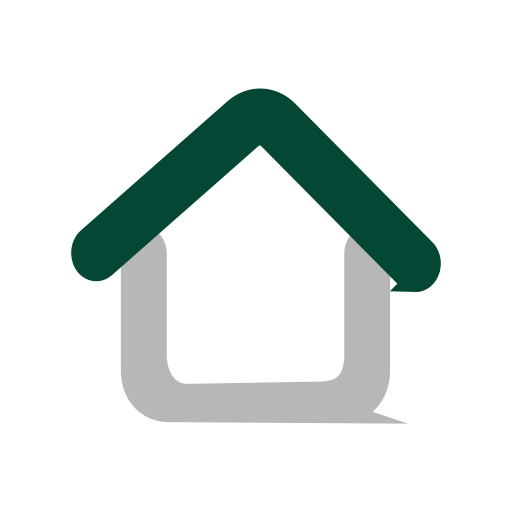

  

<h1 align="center">PendingHome</h1>

  全屋双色温灯光控制方案

  
  
  
  

这个仓库是一个方案说明文档的形式，提供一个大概思路。

这目前是设想中的方案，还未落地，因为水电还没弄好，卡住了。

仓库的大头目前是灯光控制板的设计。这类东西现成产品要么太贵，要么不符合要求，而且设计起来对AI来说算不上特别特别难的事情。按照设计预期，这块板应该能带动24V 12A 6路双色温的LED灯。设计完之后拿去嘉立创打样。

## 仓库内容

| 目录 | 是什么 |
|---|---|
| [`ha-home/`](ha-home/) | 主力 HA 部署：台式机跑 Debian + Docker，含一套能造出**开机自配置**系统镜像的脚本，以及 Zigbee 接入的现场排障记录 |
| [`ha-t630/`](ha-t630/) | 惠普 t630 瘦客户机做 HA 主机的部署，以及 HA + Scrypted 把大华摄像头接进 HomeKit（含 HKSV） |
| [`ha-lab/`](ha-lab/) | Mac 上的 Lima 虚拟机试验台。`ha-home` 就是从它平移过来的，现已退役 |
| [`sensor-nodes/`](sensor-nodes/) | ESP32-C3 传感器节点的 ESPHome 固件（CO₂、光谱、门窗磁），含选购清单 |
| [`docs/`](docs/) | 跨项目的设计文档 |
| [`cct-driver/`](cct-driver/) | 6 路 CCT 灯驱动板：KiCad 工程、生产文件、ESPHome 固件、验板清单 |

顶层的 `t630-*.sh` 是给 t630 那台机器做裸机引导（USB 直连 / PXE）的 Mac 侧脚本。

